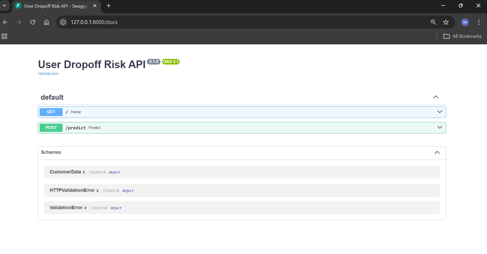
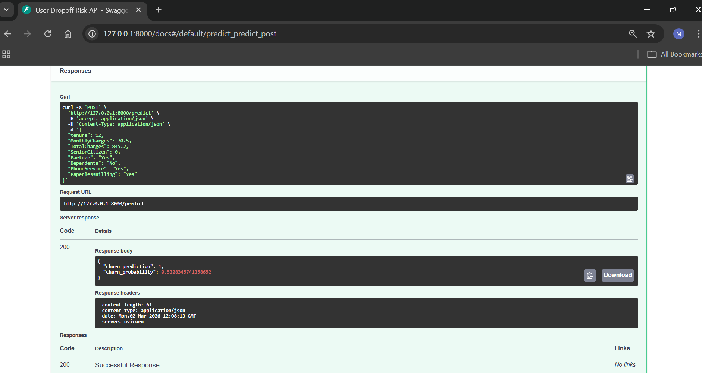

# User Dropoff Risk API

An end-to-end machine learning system that predicts customer churn risk in real time using FastAPI.

This project demonstrates the complete ML lifecycle:

- Data preprocessing and feature engineering  
- Logistic Regression churn model  
- Model serving via FastAPI  
- Real-time prediction endpoint  
- Interactive Swagger testing  

Built as a production-style ML project for portfolio and interview demonstration.

---


## Project Overview

This project builds a complete ML pipeline that predicts whether a customer is likely to churn based on behavioral and account features.

The system includes:

- Data preprocessing and feature engineering  
- Logistic Regression and Random Forest models  
- Model evaluation and feature importance analysis  
- FastAPI backend for real-time predictions  
- Frontend UI for user interaction  
- Production-style project structure  

---

## Problem Statement

Customer churn is a major business challenge. This project helps identify high-risk customers early so companies can take proactive retention actions.

---

## Project Architecture

User Input → Frontend UI → FastAPI Backend → ML Model → Prediction → Response

---

## Tech Stack

**Languages & Libraries**

- Python  
- Pandas  
- NumPy  
- Scikit-learn  
- Joblib  

**Backend**

- FastAPI  
- Uvicorn  

**Frontend**

- HTML  
- CSS  
- JavaScript  

**Tools**

- VS Code  
- Git & GitHub  
- Jupyter Notebook  

---

##  Model Performance

### Logistic Regression

- Accuracy: ~0.74  
- Good baseline model  
- Fast and interpretable  

### Random Forest

- Accuracy: ~0.79  
- Better handling of non-linear patterns  
- Used for feature importance analysis  

---

## Key Features

- End-to-end ML pipeline  
- Real-time prediction API  
- Automatic feature alignment  
- Production-style folder structure  
- Feature importance visualization  
- Rest API built using FastApi
- Deployed on cloud (Render) 

---

## Project Structure

```text
user-dropoff-risk-api/
│
├── api/                         # FastAPI backend
│   └── main.py
│
├── data/                        # Dataset files
│   └── churn.csv
│
├── frontend/                    # UI files
│   └── index.html
│
├── models/                      # Saved ML models
│   └── logreg_churn_v1.pkl
│
├── notebooks/                   # Model training notebooks
│   └── churn_model.ipynb
│
├── requirements.txt             # Project dependencies
└── README.md                    # Project documentation

---

## How to Run Locally

1. Clone the repository

bash

git clone <your-repo-url>
cd user-dropoff-risk-api

2. Create virtual environment

bash

python -m venv venv
venv\Scripts\activate

3. Install dependencies

pip install -r requirements.txt

4. Run the API

bash

uvicorn api.main:app --reload

5. Open Swagger UI

http://127.0.0.1:8000/docs

##  Live Demo

Frontend (User Interface): https://velvety-gaufre-75945c.netlify.app

Backend API (FastAPI Swaggwer Docs): https://user-dropoff-risk-api-1.onrender.com/docs

You can test the API directly using the interactive Swagger UI.(Note: The API may take up to 30–50 seconds to respond on first request due to free-tier cold start.)

## Sample Prediction Request

```json
{
  "tenure": 12,
  "MonthlyCharges": 70.5,
  "TotalCharges": 845.2,
  "SeniorCitizen": 0,
  "Partner": "Yes",
  "Dependents": "No",
  "PhoneService": "Yes",
  "PaperlessBilling": "Yes"
}
```

---

## API Preview

### Swagger UI


### Prediction Result
